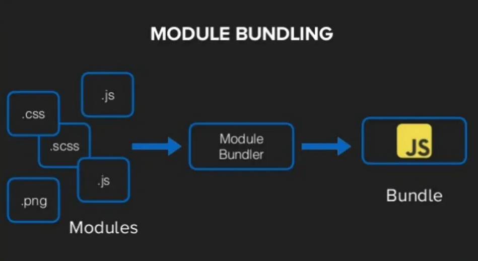
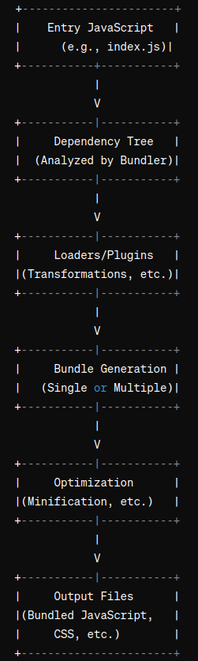

# CODESPLITTING

## What is Code Bundler?

In ReactJS, Bundler typically refers to a tool like Webpack, Parcel, or Browserify. These bundlers are used to bundle together JavaScript files, CSS files, images, and other assets into a single, optimized package that can be efficiently served to users.

Webpack, for example, is a popular choice for React projects. It can be configured to bundle together React components, JSX files, CSS modules, and various other assets, while also allowing for features like code splitting and hot module replacement, which are essential for efficient development and production builds.

## How Code Bundler works

A code bundler, like Webpack or Parcel, works by taking multiple separate files (such as JavaScript modules, CSS files, images, etc.) that make up a web application and combining them into a single or multiple bundles. Here's an overview of how it typically works:
Entry Point: 

    1. Entry Point: 

    The bundler starts by looking at one or more entry points specified in the configuration. These entry points are usually JavaScript files where the application starts.

    2. Dependency Resolution: 

    The bundler analyzes the code in the entry points and recursively follows the import statements to understand the dependencies of each file. For example, if a JavaScript file imports another module, the bundler will identify and track that dependency.

    3. Code Transformation:

     Optionally, the bundler may apply transformations to the code using loaders or plugins. For example, it may transpile modern JavaScript (ES6+) syntax into older syntax that is compatible with older browsers using Babel, or it may preprocess CSS with PostCSS.

    4. Bundle Generation:

    Once all dependencies are resolved and transformations are applied, the bundler creates one or more bundles. These bundles typically include all the code necessary to run the application, including the dependencies, transformed code, and any other assets like images or CSS.

    5. Optimization:

    This could include minification (removing whitespace and comments), tree shaking (removing unused code), or code splitting (splitting code into smaller bundles to improve loading times).

    6. Output:

    Finally, the bundles are written to disk or served directly to the browser, depending on the configuration. During development, the bundler may also set up a development server to serve the bundles and automatically reload the page when changes are made to the code.





## Problem With large bundle size:

1. Slow Initial Load Times: A large bundle size means there's more data to download when a user first visits your website. This can result in slower initial load times, especially on slower internet connections or less powerful devices. 

2. Increased Bandwidth Usage: Large bundles require more bandwidth to download, which can increase hosting costs for the website owner and lead to higher data usage for users, particularly on mobile devices with limited data plans.

3. Reduced Caching Efficiency: Caching is less effective for large bundles because the entire bundle needs to be re-downloaded even if only a small part of it has changed. This can negate the benefits of browser caching and result in slower subsequent page loads.

    
## Benefits With large bundle size:

1. Reduced Network Requests: Having a large bundle means that all the required code is bundled together in a single file. In some cases, this can reduce the number of network requests needed to fetch resources, which can be beneficial, especially in situations where there are latency concerns or limitations on the number of concurrent connections.

2. Offline Availability: For applications that need to work offline or in low-connectivity environments, having a large bundle with all the necessary code included can ensure that the application functions properly even when the network is unavailable. This can be useful for certain types of applications, such as Progressive Web Apps (PWAs).

3. Simplified Deployment: Managing a single large bundle may be simpler than dealing with multiple smaller files, especially in environments where deploying many files is cumbersome or prone to errors. This can streamline the deployment process and reduce the chances of deployment-related issues.


##  What is Code Splitting

Code splitting is a technique used in web development to improve the performance of web applications by breaking the application code into smaller bundles that can be loaded on demand. Instead of serving the entire application codebase in a single bundle, code splitting allows developers to split the code into multiple smaller bundles, which are then loaded dynamically as needed.  

Here's how code splitting typically works:

1. Identifying Split Points: Developers identify logical split points in their application where it makes sense to divide the code into separate bundles. These split points often correspond to different routes in a single-page application (SPA) or different features/modules within the application.

2. Configuring the Bundler: Developers configure their bundler (such as Webpack) to implement code splitting based on these identified split points. They can specify which parts of the application should be split into separate bundles and how those bundles should be loaded.

3. Dynamic Imports: Code splitting is often implemented using dynamic import statements in JavaScript. Instead of importing a module statically at the top of a file, developers use dynamic import() syntax to import modules asynchronously at runtime.

4. Loading Bundles on Demand: When a user interacts with the application and triggers a split point, the corresponding bundle is loaded dynamically. This allows the initial page load to be faster because only the essential code for rendering the initial view is loaded upfront. Subsequent bundles are then loaded on demand as the user navigates through the application.


## Lazy Loading

Lazy loading is a technique/ design pattern used in web development to defer the loading of non-essential resources until they are needed. This can significantly improve the initial load time of a web page by only loading the necessary content upfront and delaying the loading of secondary content until it's requested by the user. There are several types of lazy loading commonly used in web development:

1. Image Lazy Loading
2. Lazy Loading of JS
3. Lazy Loading of CSS
4. Font Lazy Loading
5. Component Lazy Loading

### Routes Lazy Loading
Lazy loading routes in a React application involves dynamically importing components associated with different routes only when they are needed, rather than including them in the main bundle

```
// App.js

import React from 'react';
import { BrowserRouter as Router, Route, Switch } from 'react-router-dom';

// Import a loading spinner or placeholder component for suspense fallback
import LoadingSpinner from './LoadingSpinner';

// Lazy load route components
const Home = React.lazy(() => import('./Home'));
const About = React.lazy(() => import('./About'));
const Contact = React.lazy(() => import('./Contact'));

function App() {
  return (
    <Router>
      <React.Suspense fallback={<LoadingSpinner />}>
        <Switch>
          <Route path="/" exact component={Home} />
          <Route path="/about" component={About} />
          <Route path="/contact" component={Contact} />
        </Switch>
      </React.Suspense>
    </Router>
  );
}

export default App;
```
```
// LoadingSpinner.js

import React from 'react';

function LoadingSpinner() {
  return <div>Loading...</div>;
}

export default LoadingSpinner;
```

### Component Lazy loading
If you want to lazy load components dynamically within another component, you can use React's lazy() function along with Suspense. This technique is useful when you want to load components based on user interactions or other runtime conditions. Here's an example:

```// ParentComponent.js
import React, { useState, Suspense } from 'react';

const LazyLoadedComponent = React.lazy(() => import('./LazyLoadedComponent'));

const ParentComponent = () => {
  const [showComponent, setShowComponent] = useState(false);

  const handleClick = () => {
    setShowComponent(true);
  };

  return (
    <div>
      <button onClick={handleClick}>Load Lazy Component</button>
      {showComponent && (
        <Suspense fallback={<div>Loading...</div>}>
          <LazyLoadedComponent />
        </Suspense>
      )}
    </div>
  );
};

export default ParentComponent;
```

### Lazy Loading JS files

 ```
 // lazyLoadedFunction.js

export const lazyLoadedFunction = () => {
  console.log('This function was lazily loaded!');
};
```

```
// MyComponent.js

import React, { useState } from 'react';

const MyComponent = () => {
  const [isLoaded, setIsLoaded] = useState(false);

  const handleClick = async () => {
    // Dynamically import the JavaScript file when the button is clicked
    const { lazyLoadedFunction } = await import('./lazyLoadedFunction.js');
    lazyLoadedFunction();
    setIsLoaded(true);
  };

  return (
    <div>
      <button onClick={handleClick}>Load Lazy Function</button>
      {isLoaded && <div>The lazy function has been loaded!</div>}
    </div>
  );
};

export default MyComponent;
```


### Use Case for lazy loading js files
One real-world use case for lazy loading JavaScript files is in a web application that includes multiple features or modules, where not all features are needed immediately upon initial load. Lazy loading JavaScript files allows you to defer the loading of certain scripts until they are required, improving the initial load time and reducing the overall bundle size of your application.

#### Example
1. Initial Load: Upon visiting the email client application, only the essential JavaScript files necessary for rendering the inbox and basic functionality are loaded. This ensures a fast initial load time for the user.

2. Lazy Loading: As the user interacts with the application, additional features such as compose, contacts, and settings may be accessed. Instead of loading all JavaScript files upfront, you can lazy load the JavaScript files associated with these features only when they are accessed by the user.

Another real-world example of lazy loading JavaScript files is in a content management system (CMS) or a blogging platform where users can create and manage multiple pages or posts with different content types and functionalities.

In this scenario, each page or post may have its own set of JavaScript files associated with specific features, such as:

1. Rich Text Editor: JavaScript files for a rich text editor (e.g., TinyMCE or Quill) used for composing and editing content.
    
2. Image Gallery: JavaScript files for an image gallery component used to display and manage images within the content.

3. Comments Section: JavaScript files for a comments section or discussion component for user engagement and interaction.

4. Analytics Integration: JavaScript files for integrating analytics tracking or monitoring tools to gather insights on user behavior.

5. Custom Widgets: JavaScript files for custom widgets or components added to specific pages or posts for additional functionality.

## Lazy loading npm libraries

Lazy loading npm libraries in a React application can be achieved by dynamically importing the library when it's needed, typically within a component or a function.

 This technique allows you to load the library asynchronously, reducing the initial bundle size and improving performance. Here's how you can lazy load an npm library in a React component:

 ```
 import React, { useState } from 'react';
import axios from 'axios';

const MyComponent = () => {
  const [isLibraryLoaded, setIsLibraryLoaded] = useState(false);
  const [responseData, setResponseData] = useState(null);
  const [error, setError] = useState(null);

  const handleClick = async () => {
    try {
      // Dynamically import the npm library when the button is clicked
      const axios = await import('axios');

      // Make an API call using Axios
      const response = await axios.get('https://api.example.com/data');
      setResponseData(response.data);

      setIsLibraryLoaded(true);
    } catch (error) {
      setError(error.message);
    }
  };

  return (
    <div>
      <button onClick={handleClick} disabled={isLibraryLoaded}>
        {isLibraryLoaded ? 'Library Loaded' : 'Load Library and Call API'}
      </button>
      {responseData && <div>API Response: {JSON.stringify(responseData)}</div>}
      {error && <div>Error: {error}</div>}
    </div>
  );
};

export default MyComponent;
```

### Use Case for lazy loading npm libraries
A real use case for lazy loading a library in a React application is when you have a large library that is only needed for certain parts of your application

#### Example
 consider a scenario where you have a dashboard application with multiple pages, and one of the pages includes a complex data visualization component that relies on a large data visualization library like D3.js. However, not all users will visit this page, so loading D3.js upfront for every user would unnecessarily increase the initial bundle size and load time of the application.

 ## Prefetching
 Prefetching is a technique used to improve web page performance by proactively fetching resources that are likely to be needed in the future, before they are actually requested by the user. It involves instructing the browser to load certain resources (such as JavaScript files, CSS files, or images) in the background, during idle time or when network bandwidth is available, rather than waiting for them to be requested by the user's actions.

 Prefetching can be particularly beneficial for resources that are not immediately required for rendering the current page but are likely to be needed in subsequent interactions or navigation. By prefetching these resources, the browser can reduce perceived latency and improve the overall user experience.


 There are different ways to implement prefetching:
 1. Link Prefetching: 
    
    In HTML, you can use the <link rel="prefetch"> tag to prefetch resources. For example:

    ```<link rel="prefetch" href="path/to/resource.js">```

2. DNS Prefetching: 
    
    You can prefetch DNS resolutions for domain names using the <link rel="dns-prefetch"> tag. For example:

    ```<link rel="dns-prefetch" href="//example.com">```

3. Webpack Magic Comments:

     With webpack, you can use magic comments like /* webpackPrefetch: true */ to instruct webpack to generate additional code for prefetching resources during the bundling process.


### Prefetching using magic comments
Webpack magic comments are annotations that you can add to your import statements to instruct webpack to handle certain tasks.

One common use case is prefetching resources. Prefetching allows you to tell the browser to load certain resources (like JavaScript files) in the background, without blocking the initial page load. Here's how you can use webpack magic comments for prefetching:

    import(/* webpackPrefetch: true */ './module');

Webpack will then generate additional code to prefetch module.js when the browser has idle time.

Make sure your webpack configuration supports prefetching. You may need to enable prefetching in the output section of your webpack configuration:

   ``` 
   output: {
        // other output config...
        prefetch: true
    }
 ```


Example: 

Suppose you have a React component named LazyLoadedComponent that you want to prefetch. You can use the /* webpackPrefetch: true */ magic comment like this:

```
import React from 'react';

const LazyLoadedComponent = React.lazy(() =>
  import(/* webpackPrefetch: true */ './LazyLoadedComponent')
);

function App() {
  return (
    <div>
      <React.Suspense fallback={<div>Loading...</div>}>
        <LazyLoadedComponent />
      </React.Suspense>
    </div>
  );
}

export default App;
```

